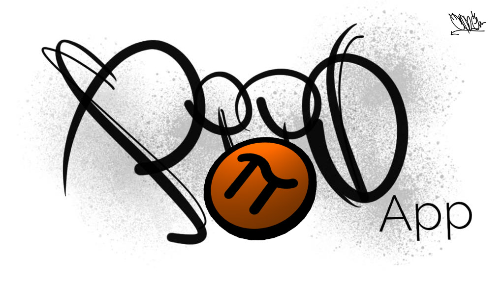

# PiioApp

### Based on EasyRTC

## Team Project (University of Lodz, WMII)
##### Authors: Michał Żakowski , Damian Henisz, Adam Wójcik

Piio is our first web application based on EasyRTC. It is a simple real-time application with chat and paintable area.

## Quick Setup:

```sh
$ npm install
$ nodw server/server.js
```

Open new tab at https://localhost

## Peace :D
